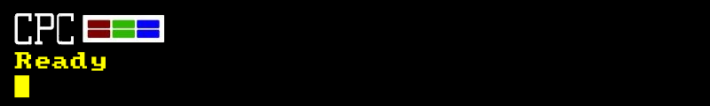

       <a href="https://github.com/destroyer-dcf/CPCReady/pulse" alt="Activity"></a>   


**CPCReady** es un conjunto de herramientas que ayudan y facilitan el desarrollo en lenguaje de programación Locomotive Amstrad Basic con Visual Studio Code.
La aplicacion solo funciona en sistemas OSX y linux, pero es posible utilizar en Windows con WSL o en una maquina virtual.


### Caracteristicas

Algunas de las caracteristicas incluidas en **CPCReady** son:

- Creación de proyectos.
- Programación en Basic por objetos (BAS independientes).
- Generacion de imagenes DSK y archivos preparados para M4 Board.
- test y pruebas sobre RetrovirtualMachine Desktop y Web.
- Integración con 8BP.
- Y mucho mas....

**Puedes acceder a la documentación completa del proyecto desde** [aqui](https://cpcready.github.io/doc/)

# Listado de Comandos

Podemos ejecutar **CPCReady** desde el shell con uno de los siguientes comando que estan disponibles: cpc, cpcr o bien cpcready

Disponesmos de los siguientes comandos con sus opciones

* [new](#new)
* [run](#run)
* [save](#save)
* [mode](#mode)
* [disc](#disc)
* [cpc](#cpc)
* [cls](#cls)
* [about](#about)


<a name="new"></a>
## new
```

Create new CPCReady project.

Use: new [option]
  -h, --help     Show this help message.
  -v, --version  Show version this software.

Ready
█
```
<a name="save"></a>
## save
```

Create disk image with project files.

Use: save [option]
  -h, --help     Show this help message.
  -v, --version  Show version this software.
Option:
  [parameter] Amstrad CPC Models. Options values [464,664,6128].
              If the parameter is empty, shows the
              current value.

Ready
█
```
<a name="run"></a>
## run
```
Run the disk image in the RVM emulator.

Use: run [option]
  -h, --help     Show this help message.
  -v, --version  Show version this software.
Option:
  [parameter]  Execute BAS File in RetroVirtualMachine.
               If the parameter is empty, RVM is executed
               only with the DSK image.

Ready
█

```
<a name="mode"></a>
## mode
```
Change screen mode.

Use: mode [option]
  -h, --help     Show this help message.
  -v, --version  Show version this software.
Option:
  [parameter]  Screen Mode. Options values [0,1,2].
               If the parameter is empty, shows the
               current value.

Ready
█

```
<a name="disc"></a>
## disc
```
Create disk image.

Use: disc [option]
  -h, --help     Show this help message.
  -v, --version  Show version this software.
Option:
  [parameter]  Name of disc image to create.
               If the parameter is empty, shows the
               current value.

Ready
█

```
<a name="cpc"></a>
## cpc
```
Change CPC Model.

Use: cpc [option]
  -h, --help     Show this help message.
  -v, --version  Show version this software.
Option:
  [parameter] Amstrad CPC Models. Options values [464,664,6128].
              If the parameter is empty, shows the
              current value.

Ready
█

```
<a name="clear"></a>
## clear
```
Clear console.

Use: cls

Ready
█


```
<a name="about"></a>
## about
```
Show information about this software.

Use: about

Ready
█

```

